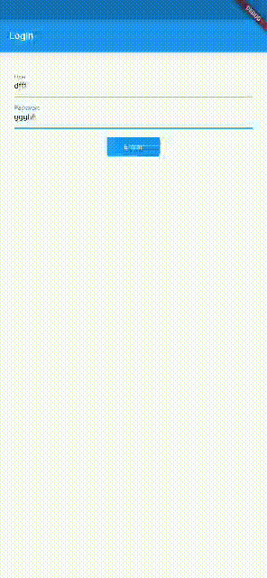

# loading_button

Loading button with simple implementation



# How to use
## pubspec.yaml
```
loading_button: <lastest version>
```

## import
```
import 'package:loading_button/loading_button.dart';
```

## Simple implementation
```
LoadingButton(
  onPressed: bloc.tryLogin,
  isLoading: false,
  child: Text(
    "Entrar",
    style: TextStyle(color: Colors.white),
  ),
);
```

## Custom loading implementation
```
LoadingButton(
  onPressed: bloc.tryLogin,
  isLoading: false,
  loadingWidget: SizedBox(
    width: 25,
    height: 25,
    child: Center(
      child: CircularProgressIndicator(
        valueColor:
            AlwaysStoppedAnimation<Color>(Colors.white),
      ),
    ),
  ),
  child: Text(
    "Entrar",
    style: TextStyle(color: Colors.white),
  ),
);
```

## Streams implementation
```
StreamBuilder<bool>(
  stream: bloc.loadingController,
  initialData: bloc.loadingController.value,
  builder: (context, snapshot) {
    return LoadingButton(
      onPressed: bloc.tryLogin,
      isLoading: snapshot.data,
      child: Text(
        "Entrar",
        style: TextStyle(color: Colors.white),
      ),
    );
  },
)
```

## All properties implementation
```
LoadingButton(
  onPressed: bloc.tryLogin,
  isLoading: snapshot.data,
  backgroundColor: Colors.blue,
  decoration: BoxDecoration(
    color: Theme.of(context).primaryColor,
    borderRadius: BorderRadius.circular(5),
  ),
  loadingWidget: SizedBox(
    width: 25,
    height: 25,
    child: Center(
      child: CircularProgressIndicator(
        valueColor:
            AlwaysStoppedAnimation<Color>(Colors.white),
      ),
    ),
  ),
  child: Text(
    "Entrar",
    style: TextStyle(color: Colors.white),
  ),
);
```